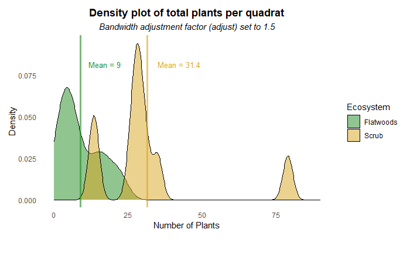
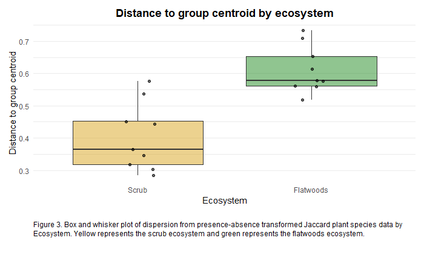
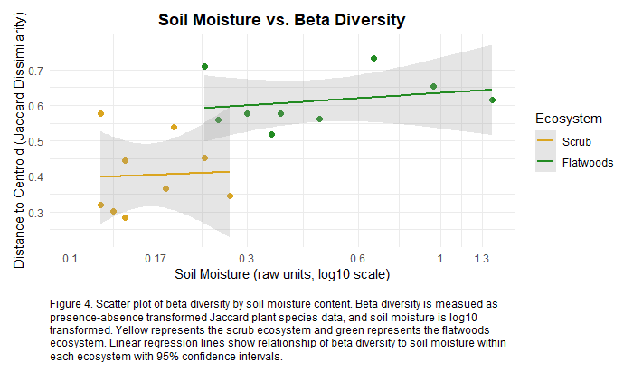

# 2025 Vegetation Survey of Two Florida Ecosystems
Kirsten Carlson  
Independent class research project, Summer 2025  
Last edited: 1/2026  
 
## Overview
This project analyzes vegetation survey data collected from two Florida ecosystem types: Saw Palmetto and Oak Scrub, and Mesic Flatwoods. Plant species abundances were recorded, along with elevation and soil moisture content from each quadrat surveyed. The goal of this analysis was to compare vegetation structure and community composition, while examining the relationship between community dissimilarity and environmental gradients. Analyses were conducted in R using exploratory statistics, visualization, and multivariate community ecology methods.  
## Study System
Saw Palmetto and Oak Scrub habitat is characterized by sandy, dry, well-drained soil. It is dominated by few plants and limited overhead canopy, and often occurs in areas of higher elevation. In this case, the habitat occurs on the Atlantic Ridge on the east coast of Florida. Mesic flatwoods generally have sparse canopy (mainly pine), with an understory of saw palmetto and other low-stature plants. The soil is sandy-loamy and contains more organic matter than scrub habitat.  
 
The flatwoods site was located less than 0.5 miles from the scrub habitat surveyed, allowing for comparison of plant communities across close proximity but environmentally distinct habitats.  
 
## Analysis Overview
The analysis includes:
- Summary statistics and density visualizations of plant abundance, soil moisture content, and elevation
- Ordination of plant community composition using Principal Coordinates Analysis (PCoA) based on Jaccard dissimilarity of presence-absence species data
- PERMANOVA to test effects of ecosystem, soil moisture content, and elevation on community composition
- Dispersion analysis using distance to group centroid
- Linear regression examining relationship between soil moisture content and beta diversity between the two ecosystems
## Results
### Summary Statistics
Scrub quadrats contained a higher mean number of plants per quadrat (mean ≈ 31) compared to flatwoods quadrats (mean ≈ 9). Soil moisture content also differed between ecosystems, with flatwoods exhibiting higher average soil moisture than scrub habitats. Elevation was slightly higher in scrub sites, though measurement precision was limited.  
 
  
  
  
### Community Composition (PCoA)
Principal Coordinates Analysis of presence–absence transformed plant species data revealed separation between scrub and flatwoods quadrats in ordination space. Soil moisture showed a directional correlation with community composition when fitted using `envfit`.  
 
  
### Beta diversity and dispersion
PERMANOVA results indicated that ecosystem type explained the greatest proportion of variation in community composition, with soil moisture also contributing significantly (P = 0.015). Elevation did not significantly explain variation in this dataset.  
 
Dispersion analysis showed differences in distance to group centroid between ecosystems, indicating variation in beta diversity across habitat types.  
 
 
### Beta diversity and soil moisture content
Distance to centroid (beta diversity) was plotted against soil moisture content for each quadrat. Soil moisture was log10 transformed for normality and visualization. Linear regresion models suggest a relationship between soil moisture content and beta diveristy within ecosystems.  
 
  
## Methods
The vegetation survey was conducted under permit at Fox Lake Sanctuary (managed by the Environmentally Endangered Lands program) in Titusville, Florida. Transect start locations were randomely generated along the length of the trail where survey was conducted. Quadrats were placed along 12-meter transects at the beginning, midpoint, and endpoint of each transect. All plant species within each quadrat were tallied. Elevation was measured in the field using the Gaia GPS application.  
 
Soil samples (~100g) were collected from approximately 10 cm depth and and stored in sealed plastic bags in a cooler. Gravimetric soil analysis was conducted with 50 grams of each sample, measured in individually cut disposable tin cupcake holders. Samples were placed in an oven at 105 degrees Celcius for 24 hours. They were then placed in sealed plastic containers to cool for 15 minutes before reweighing. The soil moisture content was calculated with the equation: (wet soil mass - dry soil mass) / (dry soil mass).  
 
All analyses were conducted in R using the packages **tidyverse**, **ggplot2**, and **vegan**.