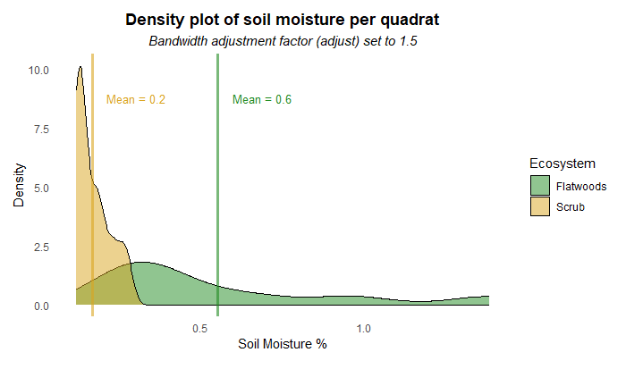
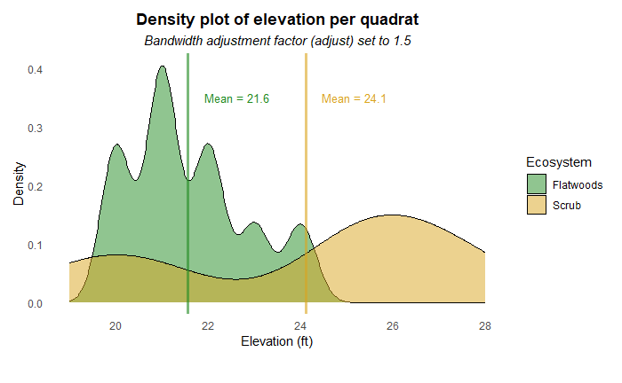
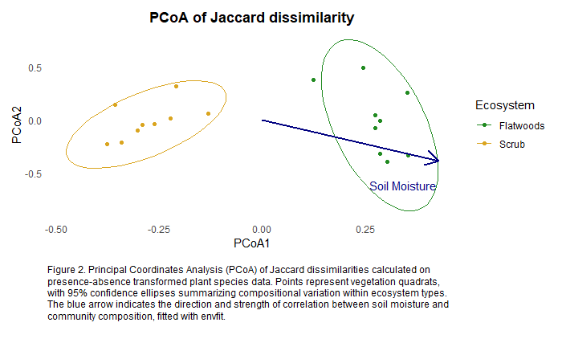

# 2025 Vegetation Survey of Two Florida Ecosystems
Kirsten Carlson  
Independent class research project, Summer 2025  
Last edited: 1/2026  
 
## Overview
This project analyzes vegetation survey data collected from two Florida ecosystems: Saw Palmetto and Oak Scrub, and Mesic Flatwoods. The dataset includes plant species abundances, elevation, and soil moisture content from each quadrat surveyed. The goal of this project was to analyze vegetation structure and compare plant communities and diversity between the two ecosystems, while examining the relationship between community composition and environmental gradients (soil moisture and elevation).  
 
Saw Palmetto and Oak Scrub habitat is characterized by sandy, dry, well-drained soil. It is dominated by few plants and limited overhead canopy, and often occurs in areas of higher elevation. In this case, the habitat occurs on the Atlantic Ridge on the east coast of Florida. Flatwoods often have sparse canopy, mainly of pines, with an understory of saw palmetto, cabbage palm, ferns, and other short height plants. The soil is sandy-loamy and contains more organic matter than scrub habitat. The flatwoods surveyed were less than half a mile from the scrub habitat surveyed, but were generally lower in elevation and higher in soil moisture content.  
 
The analysis includes summary statistics of the variables, a Principal Coordinates Analysis (PCoA) based on Jaccard dissimilarity of presence-absence plant species data, tests of beta diversity and dispersion, and correlation of soil moisture content to beta diversity.  
## Results
### Summary Statistics
Overall, the scrub habitat contained more plants per quadrat than the flatwoods, with scrub containing an average of 31 plants and flatwoods containing an average of 9.  
 
Soil moisture content also differed between ecosystems, with scrub soil having a mean of 0.2 soil moisture content (%) and flatwoods having a mean of 0.6.  
 
  
Lastly, the scrub ecosystem had a slightly higher elevation than flatwoods, although measurement accuracy was likely not high.  
 
  
### PCoA
To create the ordination, plant species data was first converted to presence-absence data. Jaccard dissimilarity was calculated using *vegdist* from the the *vegan* package in R. The PCoA residuals were calculated with *cmdscale*. Then, *envfit* from the *vegan* package was used to fit soil moisture data to the points. The PCoA was plotted with an arrow overlay of the envfit soil moisture data indicating direction and strength of correlation.  
 
  
### Jaccard distance to group centroid by ecosystem
Using *adonis2* in the *vegan* package in R, I ran a PERMANOVA test on the Jaccard distances with the variables of ecosystem, soil moisture content, and elevation (999 permutations). Ecosystem explain the most variance, although soil moisture content was also statistically significant (P = 0.015)  
 
PERMANOVA  
|  | Df | SumOfSqs | R2 | F Pr(>F) |
|---|---|---|---|---|    
|Ecosystem | 1 | 1.4130 | 0.22236 | 4.9011 | 0.001 ***|
|Soil_Moisture | 1 | 0.5495 | 0.08647 | 1.9060 | 0.015 *|  
|Elevation | 1 | 0.3559 | 0.05601 | 1.2346 | 0.255|
|Residual | 14 | 4.0363 | 0.63516 |
|Total |  | 17 | 6.3547 | 1.00000 |